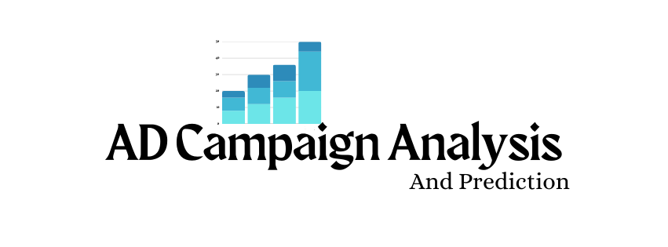

# AD-Compaign-Analysis-Prediction

## **Overview**  
- This project focuses on optimizing advertising campaigns by analyzing synthetic campaign data.  
- The dataset includes details such as budget, duration, platform, content type, target demographics, and region.  
- Key performance metrics include **Click-Through Rate (CTR), Cost Per Click (CPC), and Conversion Rate**.  
- A **Success** label indicates whether a campaign met predefined CTR and Conversion Rate thresholds.  
- The goal is to extract insights and develop predictive models to enhance campaign efficiency.  

## **Objectives**  
- **Minimize budget** while maintaining or improving campaign performance.  
- **Increase conversion rate** by identifying key factors influencing success.  
- **Optimize ad spend allocation** through data-driven insights.  
- **Leverage predictive modeling** to forecast campaign success and maximize return on investment (ROI).

## **Dataset Link**
- Kaggle dataset - [Dataset Link](https://www.kaggle.com/datasets/ashaychoudhary/advertising-campaign-performance-dataset)

## **Kaggle Notebook Link**
- Kaggle Notebook - [Notebook link](https://www.kaggle.com/code/dhineshx1/ad-compaign-analysis-and-business-insights)

## Dataset Columns Overview

 - **Campaign_ID** – Unique alphanumeric identifier for each campaign

 - **Budget** – Allocated budget for the campaign (in USD)

 - **Duration** – Number of days the campaign runs

 - **Platform** – The platform where the ad is run (Facebook, Instagram, Google, YouTube, LinkedIn)

 - **Content_Type** – Type of ad content (Image, Video, Carousel, Story, Text)

 - **Target_Age** – Age group targeted (18-24, 25-34, 35-44, 45-54, 55+)

 - **Target_Gender** – Gender targeted (Male, Female, All)

 - **Region** – Geographical region targeted (US, UK, India, Canada, Germany)

 - **Clicks** – Number of times users clicked on the ad

 - **Conversions** – Number of successful conversions

 - **CTR (Click-Through Rate)** – (Clicks / Budget) * 100

 - **CPC (Cost Per Click**) – (Budget / Clicks)

 - **Conversion_Rate** – (Conversions / Clicks) * 100

 - **Success** – Binary label (1 = successful campaign, 0 = unsuccessful campaign)

   
# Tools and Technologies
- Jupyter notebook
- pandas
- numpy
- matplotlib
- seaborn
- sklearn

# ML Model used

- **Random Forest Classifier with 89% Accuracy**

# Findings
- Invest more in YouTube and LinkedIn campaigns since they deliver high conversions at a lower cost, and cut down spending on Instagram Video campaigns, which are not performing well.

- Campaigns that include all genders perform better than those targeting males or females separately. Using a broader approach can help improve conversions.

- Some campaigns have very high CPC, which affects overall cost efficiency. Adjusting bids and optimizing these campaigns can keep costs closer to the average and improve ROI.

- Campaigns in India, Canada, and Germany are already doing well. Continuing to invest in these regions while experimenting with small budget shifts can further enhance performance.

# Thank you 

